# Python的安装，并输出第一行代码

此安装为安装Python3 

## 1. 下载Python、安装与配置

1. 下载
Python下载地址：[https://www.python.org/downloads/](https://www.python.org/downloads/)

  在此页面选择需要下载的Python版本(本人下载的3.8.3)

  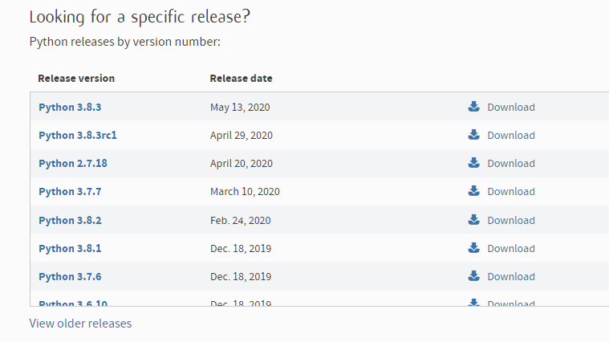

  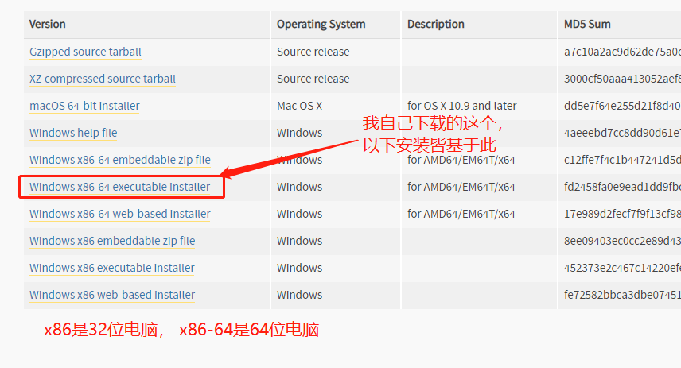

2. 安装

  1. 双击下载文件    
      
  2. 先勾选 Add Python 3.8 to PATH (版本不同，此处的数字不同)  
     选择 Cutomize installation 进入，方便我们进行自定义安装  
    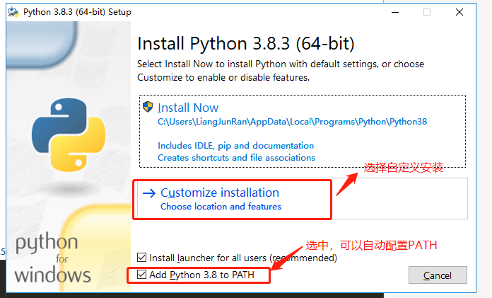
  3. 点击 Next   
    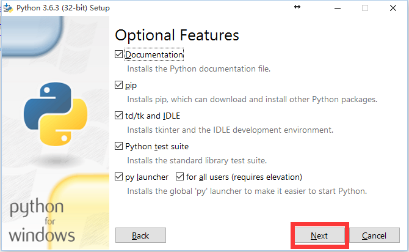  
  4. 选择自己要安装的位置，点击install  
    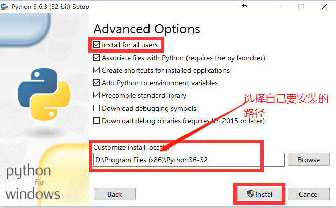  
  5. 安装中，，，  
  6. 点击Close结束安装  
    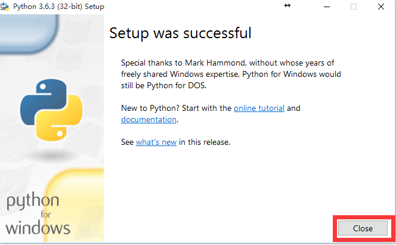  
  7. 检查是否安装成功  
    搜索框中输入“cmd”——回车，启动命令提示符——输入Python  
    
    输入 `print("你好，python")` ，  输出【你好，python】  
    
    输入 `exit()` ， 退出  
    
    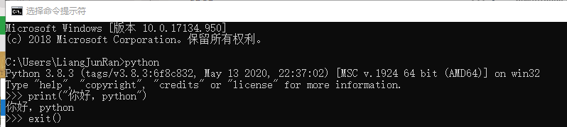

## 2. 编译器

#### 1. sublime Text3

1. 去sublime官网下载sublime Text3 

  [http://www.sublimetext.com/](http://www.sublimetext.com/)

2. 安装Package Control管理插件

  通过 [https://sublime.wbond.net/Package%20Control.sublime-package](https://sublime.wbond.net/Package%20Control.sublime-package) 下载packageControl文件  

  打开sublime Text3，选择菜单Preferences->Browse Packages，打开安装目录  
  
  此时会进入到一个叫做Packages的目录下，点击进入上一层目录Sublime Text3，在此目录下有一个文件夹叫做Installed Packages，把刚才下载的文件放到这里就可以了。然后重启sublime text3，观察Preferences菜单最下边是否有Package Settings 和Package Control两个选项，如果有，则代表安装成功了。  
  
  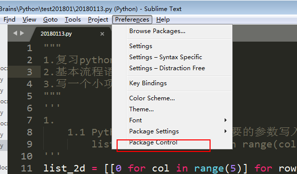

3. 设置编码和字体（也可以不设置）

  打开Preferences -> settings，加上(表示使用utf-8编码,字体大小16px,一个tab 键是四个空格键)
  
  ```
  "default_encoding": "UTF-8",
  "font_size": 16.0,
  "tab_size": 4,
  ```
  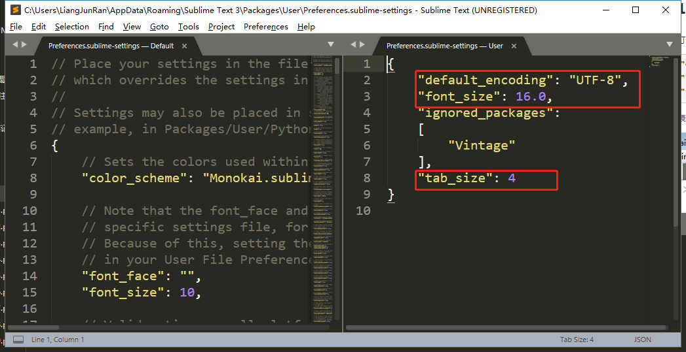
  
4. 设置python运行环境  
  
  Tools -> Build System -> Python  
  
  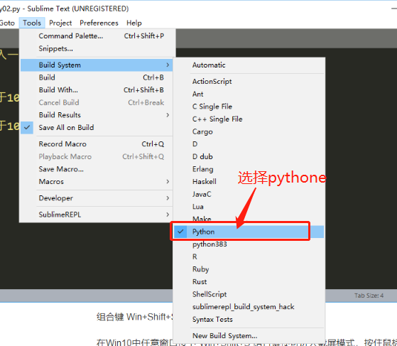
  
  新建文件夹，起名【py01.py】
  
  写入代码`print(123)`， 保存。
  
  按ctrl +b 运行，会出现以下  
  
  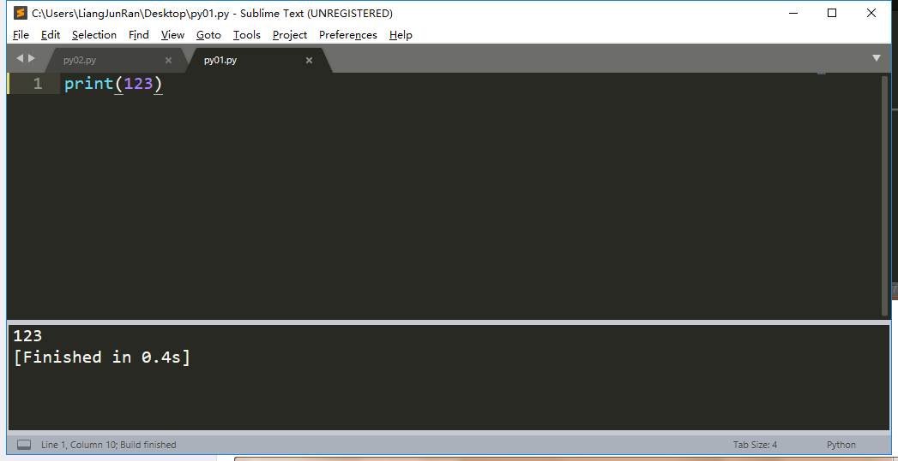
  
5. 配置python交互环境   

  由于Sublime text 3 没有默认提供python的input()的输入窗口，所以当你想要键入一些数据的时候，根本无进行操作的，所以需要安装一个叫做sublimeREPL 的插件。

  打开package control 选项 输入Install Package，回车，  
  
  此时左下角如果出现如图情况，请等待。  
  
  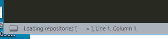
  
  在新出现的输入框里输入SublimeREPL 搜索到以后进行安装：  

  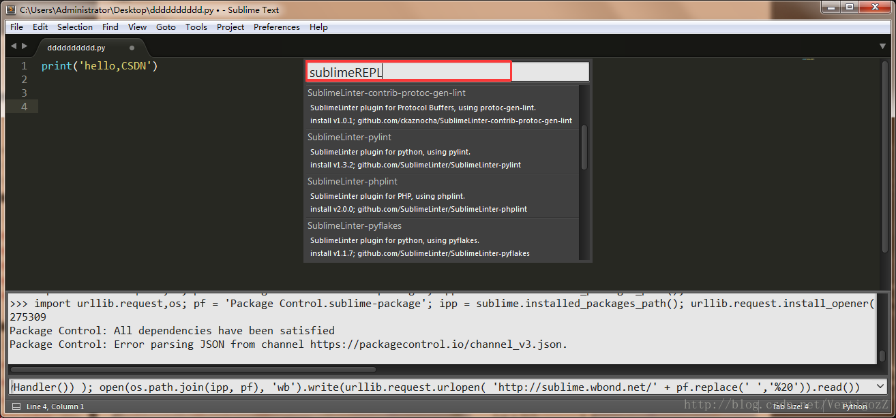
  
  新建文件夹，起名【py02.py】  
  
  写入以下代码：  
  
  ```
  a = input('输入一个数字:')
  b = int(a)
  if b >= 100:
  	print("大于100")
  else:
  	print("小于100")
  ```
  tools> SublimeREPL > python > python - run current file， 在打开的新页面输入一个数字，即打印了相应的判断结果。  
  
  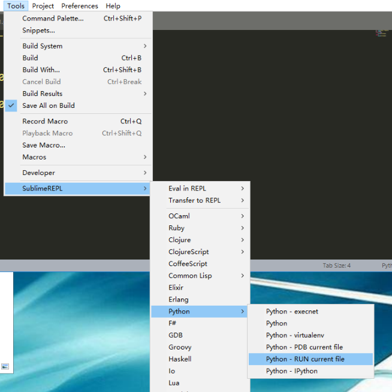  
  
  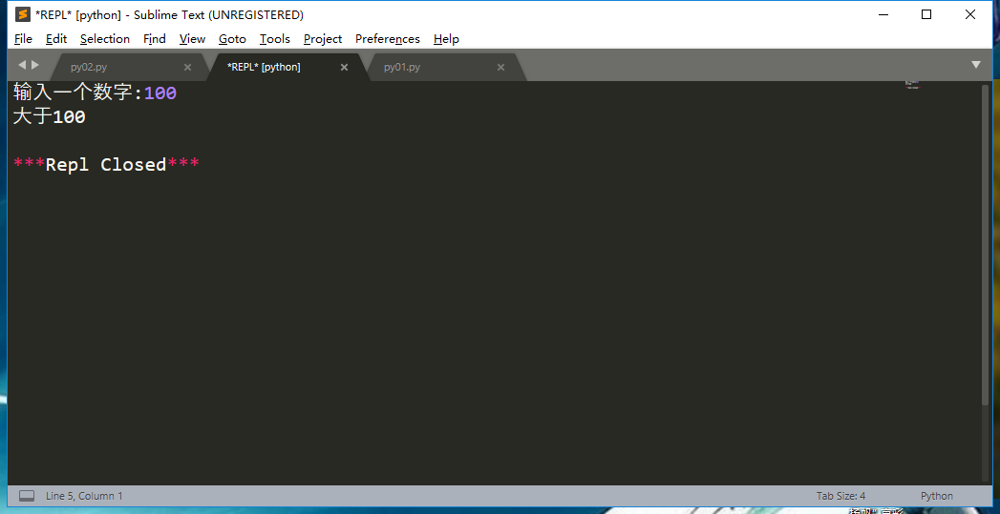  
  
6. 设置快捷键

  打开 preferences -> key bindings :
  输入以下信息后保存即可：  
  
  ```
  {
    "keys": ["f5"],  
    "caption": "SublimeREPL: Python - RUN current file",  
    "command": "run_existing_window_command", 
    "args": {"id": "repl_python_run",  
    "file": "config/Python/Main.sublime-menu"} 
  }
  
  ```
  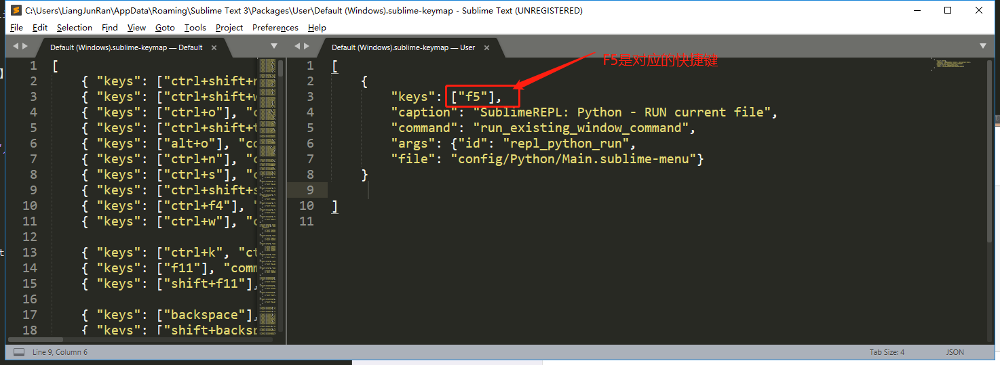
  
  此时在运行时， 直接F5即可
